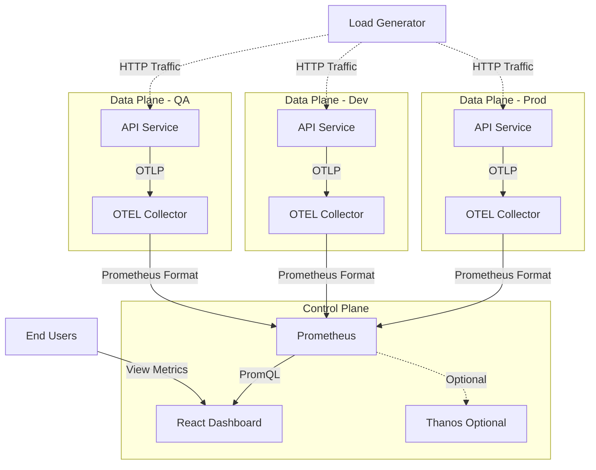
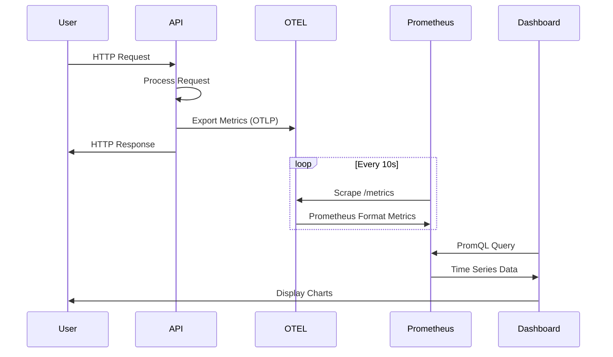

# Phase 8: Documentation & Presentation

## Overview
Create comprehensive documentation, demo materials, and prepare the PoC for presentation or handoff.

---

## Step 1: Create Main README

### 1.1 Create/Update Root `README.md`
```markdown
# OTEL Prometheus PoC

Multi-environment observability platform demonstrating OpenTelemetry metrics collection, Prometheus storage, and custom dashboarding for COTS deployments.

## Overview

This PoC demonstrates a complete observability solution where a customer deploys:
- **Control Plane**: Prometheus + Custom React Dashboard
- **Data Planes**: Multiple environments (prod, dev, qa) with OTEL-instrumented APIs
- **Metrics Pipeline**: OpenTelemetry → Prometheus → Dashboard

## Architecture

```
┌─────────────────────────────────────────────────────────┐
│                    CONTROL PLANE                         │
│  ┌──────────────┐         ┌────────────────────────┐   │
│  │  Prometheus  │◄────────┤  React Dashboard       │   │
│  └──────┬───────┘         └────────────────────────┘   │
│         │ scrape (10s)                                   │
└─────────┼────────────────────────────────────────────────┘
          │
    ┌─────┼─────┬──────────────┬──────────────┐
    │     │     │              │              │
    ▼     ▼     ▼              ▼              ▼
┌────────┐ ┌────────┐      ┌────────┐    ┌────────┐
│ PROD   │ │  DEV   │      │   QA   │    │  ...   │
│┌──────┐│ │┌──────┐│      │┌──────┐│    │        │
││ OTEL ││ ││ OTEL ││      ││ OTEL ││    │  More  │
││Coll. ││ ││Coll. ││      ││Coll. ││    │  Data  │
│└───▲──┘│ │└───▲──┘│      │└───▲──┘│    │ Planes │
│    │   │ │    │   │      │    │   │    │        │
│┌───┴──┐│ │┌───┴──┐│      │┌───┴──┐│    │        │
││ API  ││ ││ API  ││      ││ API  ││    │        │
│└──────┘│ │└──────┘│      │└──────┘│    │        │
└────────┘ └────────┘      └────────┘    └────────┘
   DATA PLANE INSTANCES (customer environments)
```

## Quick Start

### Prerequisites
- Docker 20.x+
- Docker Compose 2.x+
- 8GB RAM minimum
- Ports available: 3000, 8081-8083, 9090

### Installation

1. **Clone Repository**
   ```bash
   git clone <repository-url>
   cd otel-prometheus-poc
   ```

2. **Build and Start**
   ```bash
   # Build all images
   docker-compose build

   # Start all services
   docker-compose up -d

   # Or use helper script
   ./scripts/start.sh
   ```

3. **Verify Deployment**
   ```bash
   docker-compose ps
   # All services should be "Up (healthy)"
   ```

4. **Access Components**
   - **Dashboard**: http://localhost:3000
   - **Prometheus**: http://localhost:9090
   - **API Prod**: http://localhost:8081
   - **API Dev**: http://localhost:8082
   - **API QA**: http://localhost:8083

### Generate Test Traffic

```bash
cd load-generator
pip install -r requirements.txt

# Steady load across all environments
python load_patterns.py steady

# Spike pattern on prod
python load_patterns.py spike prod
```

### Stop and Cleanup

```bash
# Stop services (keep data)
docker-compose stop

# Stop and remove (keep data)
docker-compose down

# Complete cleanup (remove all data)
./scripts/clean.sh
```

## Project Structure

```
otel-prometheus-poc/
├── dataplane/
│   ├── api/                    # Go API service
│   └── otel-collector/         # OTEL Collector configs
├── controlplane/
│   ├── prometheus/             # Prometheus config
│   ├── thanos/                 # Thanos config (optional)
│   └── dashboard/              # React dashboard
├── load-generator/             # Traffic generation scripts
├── scripts/                    # Helper scripts
├── docker-compose.yml          # Main orchestration
├── architecture.md             # Architecture details
└── implementation-plan.md      # Development roadmap
```

## Key Features

### Multi-Environment Support
- ✅ Separate data planes for prod, dev, qa
- ✅ Environment-based metric labeling
- ✅ Centralized control plane

### OpenTelemetry Integration
- ✅ OTLP metrics from instrumented APIs
- ✅ Vendor-neutral telemetry pipeline
- ✅ Standard semantic conventions

### Custom Dashboards
- ✅ React-based UI (no Grafana licensing issues)
- ✅ Real-time metrics visualization
- ✅ Environment filtering
- ✅ ECharts for interactive charts

### Production-Ready Patterns
- ✅ Health checks on all services
- ✅ Graceful degradation
- ✅ Resource limits
- ✅ Logging and monitoring

## Demo Scenarios

### Scenario 1: Normal Operations
Shows steady-state metrics across all environments.
```bash
./load-generator/scenarios/demo_scenario_1.sh
```

### Scenario 2: Production Incident
Simulates traffic spike in production.
```bash
./load-generator/scenarios/demo_scenario_2.sh
```

### Scenario 3: QA Load Testing
Heavy load testing on QA environment.
```bash
./load-generator/scenarios/demo_scenario_3.sh
```

## Metrics Available

### Request Metrics
- Request rate (requests/second)
- Latency percentiles (p50, p95, p99)
- Error rate (percentage)
- Active requests (gauge)

### Business Metrics
- Orders created
- Payments processed
- Search queries
- Report generation

### System Metrics
- OTEL Collector health
- Prometheus scrape status
- Resource utilization

## Configuration

### Environment Variables
See `.env` file for configuration options:
- Port mappings
- Retention periods
- Error simulation rates
- Resource limits

### Scaling
To add more data planes, edit `docker-compose.yml`:
```yaml
otel-collector-staging:
  # Copy from existing collector
  environment:
    - ENVIRONMENT=staging
    - DATA_PLANE_ID=dp-staging-01
```

## Troubleshooting

### Services won't start
```bash
# Check logs
docker-compose logs

# Verify ports not in use
netstat -an | grep -E '3000|9090|8081'

# Rebuild images
docker-compose build --no-cache
```

### No metrics in dashboard
```bash
# Check Prometheus targets
open http://localhost:9090/targets

# Verify OTEL collector
curl http://localhost:8889/metrics

# Check API health
curl http://localhost:8081/health
```

### High resource usage
```bash
# Check container stats
docker stats

# Reduce batch sizes in OTEL collector config
# Reduce Prometheus retention in .env
```

## Development

See detailed implementation guides:
- [Phase 1: Data Plane API](phase-1-dataplane-api.md)
- [Phase 2: OTEL Collector](phase-2-otel-collector.md)
- [Phase 3: Prometheus & Thanos](phase-3-prometheus-thanos.md)
- [Phase 4: React Dashboard](phase-4-react-dashboard.md)
- [Phase 5: Docker Compose](phase-5-docker-compose.md)
- [Phase 6: Load Generation](phase-6-load-generation.md)
- [Phase 7: Testing & Validation](phase-7-testing-validation.md)
- [Phase 8: Documentation](phase-8-documentation.md)

## Production Deployment

This PoC uses Docker Compose for simplicity. For production:

### Use Helm Charts
Convert docker-compose to Kubernetes manifests:
```bash
# Example structure
helm/
├── Chart.yaml
├── values.yaml
└── templates/
    ├── dataplane/
    ├── controlplane/
    └── ingress.yaml
```

### Security Enhancements
- Enable TLS for all endpoints
- Add authentication to dashboard
- Secure Prometheus with basic auth
- Use secrets management (Vault, AWS Secrets Manager)

### High Availability
- Multiple Prometheus replicas with Thanos
- OTEL Collector redundancy
- Load balancing for APIs
- Multi-region deployment

### Monitoring the Monitors
- Alert on Prometheus scrape failures
- Monitor OTEL Collector health
- Dashboard uptime monitoring
- Log aggregation (ELK, Loki)

## License

[Your License]

## Contributing

[Contributing Guidelines]

## Contact

[Support Information]
```

---

## Step 2: Create Architecture Diagram

### 2.1 Create `docs/architecture-diagram.md`
```markdown
# Architecture Diagrams

## System Overview



## Data Flow



## Deployment Model

```
Customer Cloud Environment
┌─────────────────────────────────────────────────┐
│                                                  │
│  Control Plane VPC/Network                      │
│  ┌────────────────────────────────────────┐    │
│  │  - Prometheus                           │    │
│  │  - Dashboard                            │    │
│  │  - Thanos (optional)                    │    │
│  └────────────────────────────────────────┘    │
│                      │                           │
│         ┌────────────┼────────────┐             │
│         │            │            │             │
│  ┌──────▼─────┐ ┌───▼──────┐ ┌──▼─────────┐   │
│  │  Prod VPC  │ │ Dev VPC  │ │  QA VPC    │   │
│  │  - API     │ │ - API    │ │  - API     │   │
│  │  - OTEL    │ │ - OTEL   │ │  - OTEL    │   │
│  └────────────┘ └──────────┘ └────────────┘   │
│                                                  │
└─────────────────────────────────────────────────┘
```
```

---

## Step 3: Create User Guide

### 3.1 Create `docs/user-guide.md`
```markdown
# User Guide

## Getting Started

### First Time Setup

1. **Start the stack**
   ```bash
   ./scripts/start.sh
   ```

2. **Wait for services to be ready** (~30 seconds)
   ```bash
   docker-compose ps
   # All services should show "Up (healthy)"
   ```

3. **Generate initial traffic**
   ```bash
   cd load-generator
   python load_generator.py -t http://localhost:8081 -r 10 -d 60
   ```

4. **Open dashboard**
   ```bash
   open http://localhost:3000
   ```

## Using the Dashboard

### Landing Page

The landing page shows:
- System health status
- Available data planes (environments)
- Quick links to metrics

Click any **"View Metrics"** button to see that environment's dashboard.

### Metrics Dashboard

#### Top Controls

1. **Environment Selector**
   - Choose specific environment (prod, dev, qa)
   - Or select "All" to compare

2. **Time Range Selector**
   - Last 5 minutes (default)
   - Last 15 minutes
   - Last 1 hour
   - Last 6 hours
   - Last 24 hours

3. **Auto-Refresh Toggle**
   - ON: Updates every 30 seconds
   - OFF: Manual refresh only

#### Metric Cards

Summary cards show current values:
- **Request Rate**: Total requests per second
- **P95 Latency**: 95th percentile response time
- **P50 Latency**: Median response time
- **Error Rate**: Percentage of failed requests

#### Charts

1. **Request Rate Chart**
   - Shows requests/second over time
   - Separate line for each environment
   - Hover for exact values

2. **Latency Charts**
   - P95 and P50 latency trends
   - Helps identify performance degradation
   - Measured in milliseconds or seconds

3. **Error Rate Chart**
   - Percentage of 5xx errors
   - Should normally be <1%
   - Spikes indicate issues

## Using Prometheus

### Accessing Prometheus

Open http://localhost:9090

### Running Queries

**Request Rate by Environment:**
```promql
sum by (environment) (rate(otel_http_server_duration_count[5m]))
```

**P95 Latency:**
```promql
histogram_quantile(0.95,
  sum by (le) (rate(otel_http_server_duration_bucket[5m]))
)
```

**Error Rate:**
```promql
sum(rate(otel_http_server_duration_count{http_status_code=~"5.."}[5m]))
/
sum(rate(otel_http_server_duration_count[5m]))
* 100
```

**Top Slowest Endpoints:**
```promql
topk(5,
  histogram_quantile(0.95,
    sum by (http_route, le) (rate(otel_http_server_duration_bucket[5m]))
  )
)
```

### Viewing Targets

1. Go to **Status** → **Targets**
2. Check all data planes show "UP"
3. Green = healthy, Red = down

## Generating Test Traffic

### Quick Test
```bash
# Generate 10 requests
for i in {1..10}; do
  curl http://localhost:8081/api/products
done
```

### Sustained Load
```bash
cd load-generator

# Steady 50 req/sec for 5 minutes
python load_generator.py -t http://localhost:8081 -r 50 -d 300
```

### Preset Patterns
```bash
# Normal operations (all environments)
python load_patterns.py steady

# Traffic spike (prod)
python load_patterns.py spike prod

# Gradual ramp-up (qa)
python load_patterns.py ramp qa
```

## Common Tasks

### Add a New Data Plane

1. Edit `docker-compose.yml`
2. Copy existing data plane section
3. Change environment name and ports
4. Update Prometheus config to scrape new collector
5. Restart: `docker-compose up -d`

### View Logs

```bash
# All services
docker-compose logs -f

# Specific service
docker-compose logs -f api-prod
docker-compose logs -f prometheus
```

### Restart a Service

```bash
docker-compose restart api-prod
```

### Check Service Health

```bash
curl http://localhost:8081/health
curl http://localhost:9090/-/healthy
```

## Troubleshooting

### Dashboard shows "No Data"

**Check Prometheus targets:**
```bash
open http://localhost:9090/targets
```
All should be "UP". If down, check that service:
```bash
docker logs api-prod
docker logs otel-collector-prod
```

### Metrics stopped updating

**Check auto-refresh is enabled** in dashboard

**Check Prometheus is scraping:**
```bash
curl 'http://localhost:9090/api/v1/query?query=up'
```

### High error rate

**Check API logs:**
```bash
docker logs api-prod | grep -i error
```

**Reduce load:**
Stop load generator and wait for recovery

## Best Practices

### Demo Preparation

1. Start stack 5 minutes before demo
2. Run steady load pattern
3. Verify all targets UP in Prometheus
4. Open dashboard and verify data visible
5. Prepare scenario scripts

### Performance

- Don't run >100 req/sec for extended periods
- Monitor `docker stats` for resource usage
- Use appropriate time ranges (shorter = faster)

### Data Management

- Prometheus retains 15 days by default
- Clean old data: `./scripts/clean.sh`
- Export important queries as JSON

## API Reference

### Health Check
```bash
curl http://localhost:8081/health
```

### Get Products
```bash
curl http://localhost:8081/api/products
```

### Create Order
```bash
curl -X POST http://localhost:8081/api/orders \
  -H "Content-Type: application/json" \
  -d '{"product_id": "1", "quantity": 2}'
```

### Search
```bash
curl "http://localhost:8081/api/search?q=laptop"
```

### Generate Report
```bash
curl http://localhost:8081/api/reports
```

### Process Payment
```bash
curl -X POST http://localhost:8081/api/payments \
  -H "Content-Type: application/json" \
  -d '{"order_id": "123", "amount": 99.99}'
```
```

---

## Step 4: Create Demo Script

### 4.1 Create `docs/demo-script.md`
```markdown
# Demo Script

## Preparation (5 minutes before)

1. **Clean slate**
   ```bash
   ./scripts/clean.sh
   ./scripts/start.sh
   ```

2. **Generate baseline traffic**
   ```bash
   cd load-generator
   python load_generator.py -t http://localhost:8081 -r 10 -d 600 &
   python load_generator.py -t http://localhost:8082 -r 5 -d 600 &
   ```

3. **Open browser tabs**
   - Dashboard: http://localhost:3000
   - Prometheus: http://localhost:9090

## Demo Flow (15 minutes)

### Part 1: Architecture Overview (3 min)

**Talking Points:**
- "This PoC demonstrates observability for COTS deployment"
- "Customer deploys everything in their cloud"
- "Multiple environments: prod, dev, qa"
- "OpenTelemetry for vendor-neutral metrics"
- "Custom dashboard to avoid Grafana licensing"

**Show:**
- Architecture diagram
- `docker-compose ps` output

### Part 2: Dashboard Tour (4 min)

**Navigate to Landing Page**
- "Control plane shows all data planes"
- "Each customer environment appears here"
- "System health at a glance"

**Click "View All Metrics"**
- "Real-time metrics from all environments"
- "Request rate, latency, errors"
- "Environment selector for filtering"
- "Time range selection"

**Point out features:**
- Summary cards
- Interactive charts (hover over lines)
- Auto-refresh toggle

### Part 3: Multi-Environment Demo (4 min)

**Select "All Environments"**
- "Compare prod, dev, qa side-by-side"
- "Different traffic patterns visible"
- "Prod typically has higher volume"

**Select "Prod Only"**
- "Drill down into specific environment"
- "Filter out noise from other environments"

**Show Prometheus UI**
- "Raw PromQL queries for advanced users"
- Navigate to Targets page
- "All data planes being scraped"

### Part 4: Live Scenario (4 min)

**Run spike pattern:**
```bash
cd load-generator
python load_patterns.py spike prod
```

**While running:**
- "Simulating traffic spike in production"
- Watch dashboard update in real-time
- "Request rate jumps from 10 to 200/sec"
- "Latency increases under load"
- "Error rate may tick up slightly"

**Point out:**
- Clear visualization of incident
- Easy to identify affected environment
- Historical data for investigation

## Q&A Preparation

### Expected Questions

**Q: Can this scale to 100+ data planes?**
A: Yes, Prometheus can handle hundreds of targets. We'd recommend Thanos for long-term storage and federation.

**Q: What about alerting?**
A: Not in this PoC, but easily added via Prometheus Alertmanager. Can integrate with PagerDuty, Slack, etc.

**Q: How is this deployed in production?**
A: Docker Compose for PoC. Production uses Helm charts for Kubernetes deployment.

**Q: What's the licensing situation?**
A: All components are open-source. Custom dashboard avoids Grafana's AGPL restrictions for commercial products.

**Q: Can customers add custom metrics?**
A: Absolutely. Any OTEL-instrumented application can send metrics to the collector.

**Q: What about logs and traces?**
A: OTEL supports logs and traces too. This PoC focuses on metrics, but easily extended.

**Q: Resource requirements?**
A: PoC uses ~2GB RAM. Production depends on scale, typically 4-8GB for small deployments.

**Q: Data retention?**
A: Prometheus: 15 days default. Thanos extends to years via S3/object storage.

## Demo Variations

### Variation 1: Deep Dive Technical

- Show OTEL Collector config
- Explain metric labeling strategy
- Live edit PromQL queries
- Demonstrate Prometheus functions

### Variation 2: Business Focus

- Emphasize customer benefits
- Show cost savings vs Grafana Enterprise
- Highlight flexibility and control
- Discuss deployment model

### Variation 3: Incident Response

- Simulate production outage
- Show how to identify issue
- Demonstrate environment comparison
- Walk through investigation process

## Cleanup

```bash
# Stop load generators
pkill -f load_generator

# Stop stack
./scripts/stop.sh
```
```

---

## Step 5: Create Production Roadmap

### 5.1 Create `docs/production-roadmap.md`
```markdown
# Production Roadmap

## PoC → Production Gap Analysis

### Current PoC State
- ✅ Docker Compose deployment
- ✅ Basic observability pipeline
- ✅ Multi-environment support
- ✅ Custom dashboard
- ⚠️  Static configuration
- ⚠️  No authentication
- ⚠️  Limited HA
- ⚠️  Basic security

### Production Requirements

## Phase 1: Kubernetes Migration

### Convert to Helm Charts
- [ ] Create Helm chart structure
- [ ] Parameterize all configurations
- [ ] Add Kubernetes resources (Deployments, Services, ConfigMaps)
- [ ] Implement resource limits and requests
- [ ] Add pod disruption budgets
- [ ] Configure horizontal pod autoscaling

### Service Discovery
- [ ] Replace static Prometheus targets with Kubernetes service discovery
- [ ] Add pod annotations for scrape config
- [ ] Implement headless services for StatefulSets

## Phase 2: Security Hardening

### Authentication & Authorization
- [ ] Add OAuth2/OIDC for dashboard
- [ ] Implement Prometheus basic auth or OAuth proxy
- [ ] Secure OTEL Collector endpoints
- [ ] API authentication (JWT, mTLS)

### Network Security
- [ ] Enable TLS for all endpoints
- [ ] Implement network policies
- [ ] Add ingress with TLS termination
- [ ] Certificate management (cert-manager)

### Secrets Management
- [ ] External secrets (Vault, AWS Secrets Manager)
- [ ] Rotate credentials
- [ ] Audit secret access

## Phase 3: High Availability

### Prometheus HA
- [ ] Deploy multiple Prometheus replicas
- [ ] Configure Thanos for federation
- [ ] Implement Thanos Query frontend
- [ ] Add Thanos Compactor for downsampling

### OTEL Collector HA
- [ ] Deploy collector as DaemonSet or multiple replicas
- [ ] Add load balancing
- [ ] Implement failover

### Dashboard HA
- [ ] Multiple dashboard replicas
- [ ] Add load balancer
- [ ] Implement session management

## Phase 4: Advanced Features

### Alerting
- [ ] Deploy Alertmanager
- [ ] Define alert rules
- [ ] Configure notification channels (Slack, PagerDuty)
- [ ] Implement alert routing and grouping

### Advanced Dashboards
- [ ] Add SLO/SLI dashboards
- [ ] Create custom dashboard builder
- [ ] Implement dashboard templates
- [ ] Add annotation support

### Trace Integration
- [ ] Add OTEL trace collection
- [ ] Deploy Jaeger or Tempo
- [ ] Correlate traces with metrics
- [ ] Add trace visualization in dashboard

### Log Integration
- [ ] OTEL Collector log receivers
- [ ] Deploy Loki or Elasticsearch
- [ ] Correlate logs with metrics
- [ ] Add log viewing in dashboard

## Phase 5: Operational Excellence

### Monitoring the Monitors
- [ ] Prometheus self-monitoring alerts
- [ ] OTEL Collector health checks
- [ ] Dashboard uptime monitoring
- [ ] End-to-end synthetic tests

### Backup & Recovery
- [ ] Automated Prometheus snapshots
- [ ] Backup to object storage
- [ ] Disaster recovery procedures
- [ ] RTO/RPO definitions

### Cost Optimization
- [ ] Metric cardinality analysis
- [ ] Retention policy optimization
- [ ] Resource right-sizing
- [ ] S3 lifecycle policies (Thanos)

### Documentation
- [ ] Runbooks for common issues
- [ ] Disaster recovery procedures
- [ ] Security incident response
- [ ] Customer onboarding guide

## Phase 6: Advanced Capabilities

### Multi-Tenancy
- [ ] Tenant isolation
- [ ] Per-tenant resource quotas
- [ ] Tenant-specific dashboards
- [ ] RBAC implementation

### API Development
- [ ] REST API for dashboard
- [ ] GraphQL API for complex queries
- [ ] API rate limiting
- [ ] API documentation (OpenAPI)

### CI/CD Integration
- [ ] Automated testing pipeline
- [ ] Canary deployments
- [ ] Blue/green deployments
- [ ] Automated rollback

## Estimated Timeline

| Phase | Duration | Dependencies |
|-------|----------|--------------|
| Phase 1: K8s Migration | 4-6 weeks | Kubernetes cluster |
| Phase 2: Security | 3-4 weeks | Phase 1 |
| Phase 3: HA | 4-6 weeks | Phase 1, 2 |
| Phase 4: Advanced Features | 8-12 weeks | Phase 3 |
| Phase 5: Ops Excellence | 6-8 weeks | Phase 4 |
| Phase 6: Advanced Capabilities | 12-16 weeks | Phase 5 |

**Total: 9-12 months for full production implementation**

## Success Criteria

### Phase 1
- ✅ Deployed on Kubernetes
- ✅ Dynamic service discovery
- ✅ Resource limits enforced

### Phase 2
- ✅ All endpoints secured with TLS
- ✅ Authentication required for all UIs
- ✅ Secrets externalized

### Phase 3
- ✅ No single point of failure
- ✅ Automatic failover
- ✅ 99.9% uptime SLA

### Phase 4
- ✅ Automated alerting functional
- ✅ Traces integrated with metrics
- ✅ Advanced dashboards deployed

### Phase 5
- ✅ Self-monitoring alerts working
- ✅ Backup/recovery tested
- ✅ Complete documentation

### Phase 6
- ✅ Multi-tenancy working
- ✅ Public API available
- ✅ CI/CD pipeline automated

## Risk Mitigation

### Technical Risks
- **Risk**: Prometheus scalability limits
- **Mitigation**: Implement Thanos early, plan for federation

- **Risk**: Dashboard performance with large datasets
- **Mitigation**: Query optimization, caching layer, data aggregation

- **Risk**: OTEL Collector becoming bottleneck
- **Mitigation**: Horizontal scaling, load balancing

### Operational Risks
- **Risk**: Customer data retention costs
- **Mitigation**: Clear retention policies, cost estimation tools

- **Risk**: Complexity for customers to operate
- **Mitigation**: Comprehensive docs, automation, managed service option

## Open Questions

1. Should we offer a managed service option?
2. What's the target customer size (data planes, metrics/sec)?
3. Cloud provider preferences (AWS, Azure, GCP, multi-cloud)?
4. Compliance requirements (SOC2, HIPAA, etc.)?
5. Support model (24/7, business hours, community)?
```

---

## Expected Outcomes

✅ **Complete Documentation**:
- Comprehensive README
- User guide
- Demo script
- Production roadmap

✅ **Professional Presentation**:
- Clear architecture diagrams
- Step-by-step guides
- Q&A preparation

✅ **Handoff-Ready**:
- All code documented
- Deployment automated
- Testing procedures defined

---

## Final Checklist

- [ ] README.md complete and accurate
- [ ] Architecture diagrams created
- [ ] User guide written
- [ ] Demo script prepared
- [ ] Production roadmap defined
- [ ] All phase guides reviewed
- [ ] Code comments added
- [ ] Configuration documented
- [ ] Troubleshooting guide complete
- [ ] Screenshots/videos captured (optional)

---

## Project Complete! 🎉

The OTEL Prometheus PoC is now fully documented and ready for demonstration or handoff.
